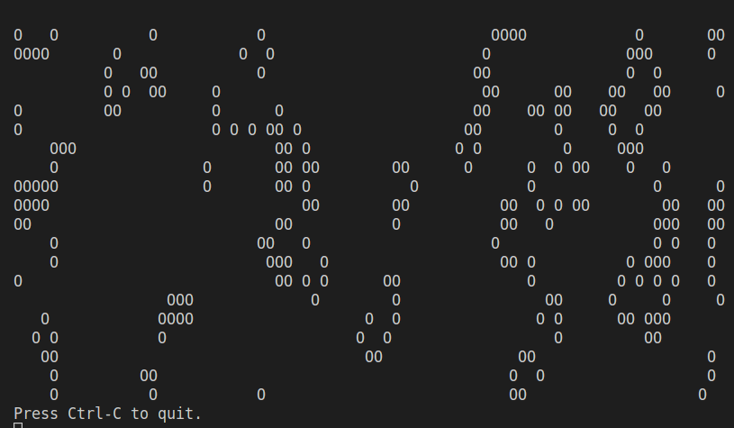

# Conway Game of Life

## Description

The Conway's Game of Life is a cellular automata simulation invented in 1970 by British mathematician John Horton Conway.

The program initializes a grid of cells with random states of being alive or dead, and then updates the grid according to a set of rules for each iteration. The rules determine which cells will live or die based on the number of neighboring cells that are alive.

The rules of the game are;
1. Any live cell with two or three live neighbours survives.
2. Any dead cell with three live neighbours becomes a live cell.
3. All other live cells die in the next generation. Similarly, all other dead cells stay dead.

The "game" is actually a zero-player game, meaning that its evolution is determined by its initial state, needing no input from human players. One interacts with the Game of Life by creating an initial configuration and observing how it evolves.

This program implements Conway's Game of Life using a cellular automaton model

## How it Works

- The program implements Conway's Game of Life using a cellular automaton model. It randomly initializes a grid of dead and alive cells and then updates the grid for each time step based on the rules of the game. The updated grid is displayed on the console, and the animation is slowed down to make it easier to observe.

- The program starts by importing the necessary modules: `copy`, `random`, `sys`, and `time`. These modules are used for various functionalities.

- The program defines several consants; `WIDTH` and `HEIGHT` define the size of the cell grid. `ALIVE` and `DEAD` represent the symbols for living and dead cells, respectively.

- The `main()` function starts by printing the title of the simulation. Then it initializes the `next_cells` dictionary with random dead and alive cells. It then enters an infinite loop, representing the iterations of the simulation. Inside the loop, it calls `display_cells()` to print the current state of the cells, then creates a copy of `next_cells` using `copy.deepcopy()` and assigns it to cells. This ensures that the changes made in the `update_cells()` function do not affect the current generation. The `update_cells()` function is then called to update the state of `next_cells` based on the current state in cells.

- The `display_cells(cells)` function is defined to display the current state of the cells on the console. It iterates over each cell in the grid and prints the corresponding symbol.

- The `update_cells(cells, next_cells)` function updates the state of the cells based on Conway's Game of Life rules. It iterates over each cell in the grid, counts the number of living neighbors for each cell, and determines whether the cell should be alive or dead in the next generation.

- The loop continues indefinitely until the user interrupts it by pressing Ctrl-C. Upon interruption, the program exits.

## Program Input & Output

When you run `conway.py`, the output will look like this 5s gif;

