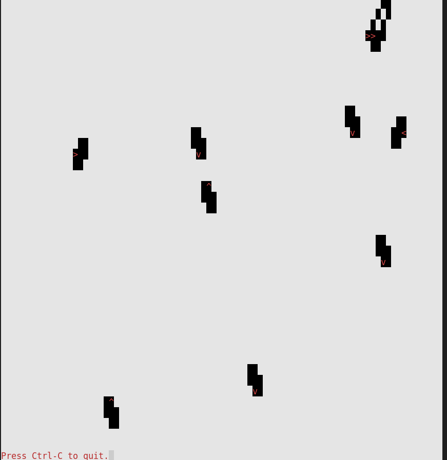

# Langton Ant Simulator

## Description

The Langton Ant Simulator is a program that simulates an ant colony using ASCII characters and a cellular automaton model.

In the simulation, a two-dimensional grid represents the environment of the ant colony. Each cell in the grid can be in one of two states: black or white, represented by ASCII characters. The ants move around the grid, leaving trails and changing the state of the cells as they interact with them.

## How it Works

- The program begins by importing the necessary modules: `copy`, `random`, `sys`, `time`, and `bext` (a custom module for console output).

- Constants and variables are set up:
    - `SCREEN_WIDTH` and `SCREEN_HEIGHT` are obtained from the `bext.size()` function, representing the dimensions of the console screen.
    - `NUMBER_OF_ANTS` determines the number of ants in the simulation.
    - `PAUSE_AMOUNT` controls the time delay between each step in the simulation.
    - Constants like `ANT_UP, ANT_DOWN, ANT_LEFT, ANT_RIGHT, ANT_COLOR, BLACK_TILE, WHITE_TILE, NORTH, SOUTH, EAST`, and `WEST` define characters and colors used for display.

- The `main()` function is defined, it sets the color and background, creates the initial board and ant data structures, and starts the main program loop.

- The `create_board()` function creates the initial board data structure, represented as a dictionary with the width and height of the screen.

- The `create_ants()` function creates the initial ant data structures. It generates a list of dictionaries, each representing an ant with random starting positions and directions.

- The `update_board()` function updates the board and ants for the next step in the simulation. It creates a copy of the current board, iterates over each ant, determines the ant's behavior based on its current position on the board, updates the ant's direction, moves it forward, and wraps the ant's position around the screen if it goes out of bounds. The updated board is returned.

- The `turn_clockwise()` and `turn_counter_clockwise()` functions change the ant's direction based on clockwise and counterclockwise turns, respectively.

- The `move_ant_forward()` function moves the ant forward in its current direction by adjusting its x and y coordinates.

- The `display_board()` function displays the board and ants on the screen. It clears the console, iterates over each cell in the board, and prints a black space character on the screen if the cell is occupied. It then iterates over each ant, sets the cursor position based on its coordinates, and prints the appropriate ant symbol based on its direction. Finally, it displays a quit message at the bottom of the screen.

- The main() function is called to start the simulation. It wraps the simulation in a try-except block to handle the Ctrl-C (KeyboardInterrupt) signal and exit gracefully.

## Program Input & Output

When you run the program `langton_ant_sim.py`, the output will look like this;

